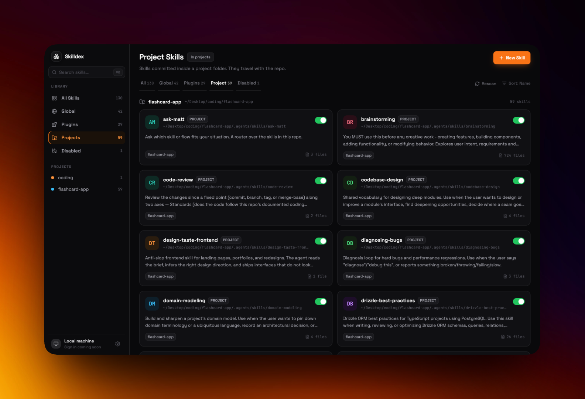

# Skilldex



**Skilldex is a local-first desktop app for managing your agent skills.** If you
use AI coding agents, your skills pile up fast — scattered across your home
directory, installed plugins, and individual project repos, each with its own
`SKILL.md`. It gets hard to remember what you have, where it lives, or whether a
skill is even turned on. Skilldex scans all of those locations, pulls every
skill into one searchable dashboard, and lets you browse, favourite, toggle, and
install skills without hunting through folders.

Everything runs on your machine. Skilldex reads your local skill directories
directly and never sends your data anywhere — the renderer has no filesystem
access and talks to disk only through a locked-down Electron bridge.

## What it does

- **One place for every skill.** Skilldex discovers skills across three kinds of
  source and normalizes them into a single catalog:
  - **Personal** — your global skills (e.g. `~/.claude/skills`)
  - **Plugin** — skills that ship with installed plugins/marketplaces
  - **Project** — skills committed inside individual project repositories
- **Search and favourites.** Filter the whole catalog instantly and pin the
  skills you reach for most.
- **Skill detail at a glance.** See each skill's description, file list, on-disk
  path, and which projects reference it.
- **Enable / disable skills** without deleting anything or editing files by hand.
- **Create new skills** from a scaffold, so a fresh `SKILL.md` and directory are
  laid out correctly for you.
- **Know where a skill came from.** When a skill records its upstream, Skilldex
  shows its provenance and deep-links straight to the source on GitHub, GitLab,
  or Bitbucket.
- **Browse and install from custom Git repos.** Point Skilldex at a GitHub skill
  repository, browse what it offers, and install skills into the scope you
  choose.
- **Smart deduplication.** A skill surfaced from more than one root is shown once
  with a stable identity, and a problem reading one source never breaks the rest.

## Built with

- Electron, React, TypeScript, Tailwind CSS, and shadcn/ui
- A context-isolated Electron preload bridge; the renderer has no direct Node.js
  or filesystem access
- A `SkillWorkspace` module behind the preload seam that discovers skill
  directories, dedups across roots, parses manifests, and isolates per-source
  errors

## Installing on macOS

Skilldex isn't notarized by Apple yet, so on first launch macOS shows
**"Apple could not verify 'Skilldex' is free of malware..."** and refuses to
open it. This is expected for an unnotarized open-source app — it's a one-time
approval, not a sign anything is wrong. Choose **Done** (not *Move to Trash*),
then approve it once:

1. Open the downloaded `skilldex.dmg` and drag **Skilldex** into **Applications**.
2. Double-click Skilldex. When the "could not verify" warning appears, click **Done**.
3. Open **Apple menu → System Settings → Privacy & Security** and scroll to the **Security** section.
4. Next to *"Skilldex was blocked to protect your Mac,"* click **Open Anyway** and confirm with Touch ID or your password.

Skilldex opens normally from then on.

Prefer the terminal? Clear the download quarantine flag once instead:

```bash
xattr -dr com.apple.quarantine /Applications/Skilldex.app
```

> On macOS 13+ (Ventura/Sonoma/Sequoia) the older right-click → **Open**
> shortcut no longer bypasses this — approval must go through **Privacy &
> Security** as above.

## Architecture

Code is organized by feature, not by generic presentation folders:

```text
src/
  app/                     # composition only
  features/
    dashboard/             # dashboard state and orchestration
    skills/                # catalog model, skill list, favourites, detail
    navigation/            # workspace navigation
    settings/              # source configuration
  ui/                      # shared shadcn/ui primitives only
  lib/                     # shared helpers
```

Each feature owns its model, state, and UI. The app module only composes features. On the Electron main side, the `SkillWorkspace` module (`electron/main/workspace/`) exposes a small interface — get config, get snapshot, configure sources, and skill-change intents — while directory walking, manifest parsing, dedup, and settings persistence stay hidden behind that seam. The renderer reaches it only through the context-isolated `window.skilldex` preload bridge.

## Run locally

```bash
npm install
npm run dev
```

## Verify

```bash
npm run build
npm run lint
npm run package
```

## Extending

New capabilities go behind the `SkillWorkspace` seam rather than into the renderer. Callers request a normalized workspace snapshot and send skill-change intents; directory walking, manifest parsing, Git inspection, dedup, and settings persistence all stay inside the module. Skill scaffolding, enable/disable, and Git provenance (upstream host deep-links from `.git/config`) already live there.

## Contributing

Contributions are welcome! See [CONTRIBUTING.md](CONTRIBUTING.md) for how to set up your environment, the conventions the codebase follows, and how to get a change merged. Skilldex is MIT-licensed.
